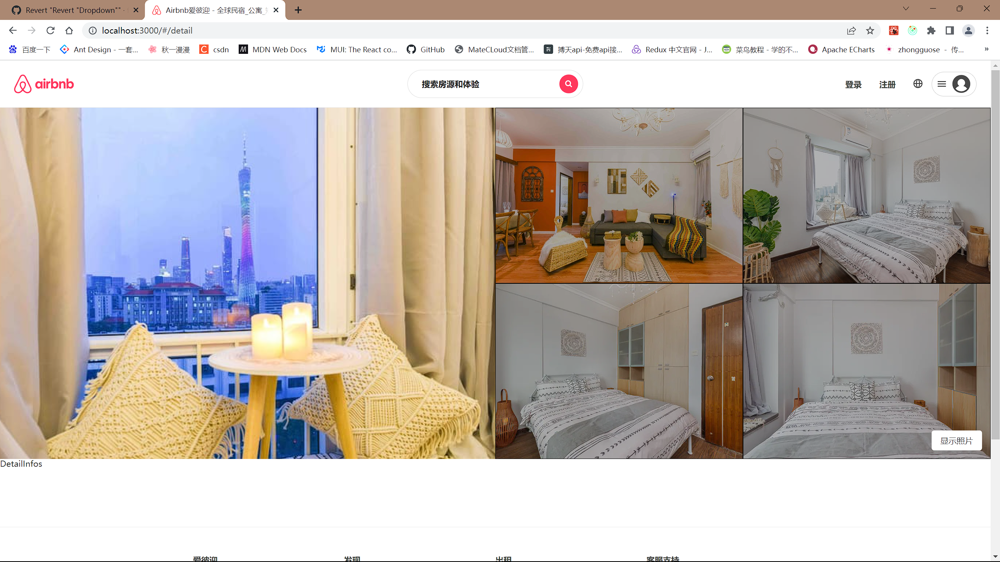
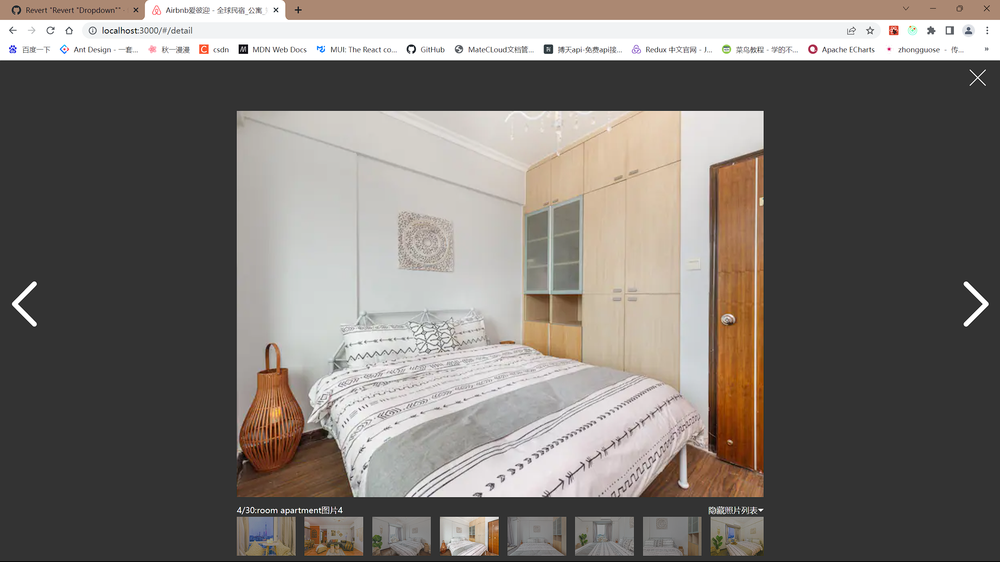

## 项目介绍

author:onlyfufu

所用技术：react18+@reduxjs/toolkit+styled-components+mui+antd+react-router-domV6

项目介绍：Airbnb 爱彼迎 - 全球民宿*公寓*短租*住宿*预订平台，可以查看各地房源，热门目的地，目的地旅游景点，高分房源，好评房源等。

- 对初学者封装组件练习，项目结构划分，项目代码规范还是挺有帮助的

#### 首页

#### entire 页面

#### 详情页面

